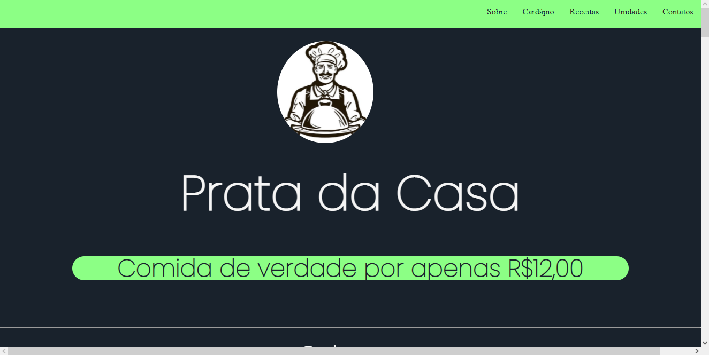

- Site restaurante - Abril 2021, grupo acadêmico

Elementos:

- Navbar;
- Transição;
- Sections;
- Formulário;

Projeto: 

- Parte do site

  

Dificuldades enfrentadas:

Este foi o primeiro site feito em conjunto logo no inicio do curso, foi possível aprender muito sobre html, css. Como fazer uma navbar na horizontal, posicionar imagem ao lado de texto, entre outras coisas mais.